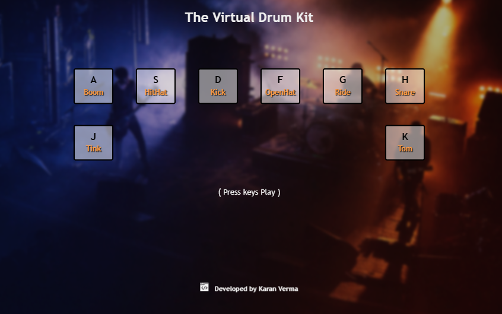

# Virtual Drum Kit

## About the Project


 <br><br>
Virtual drumkit, play instrument with a click of a button.
Use your keyboard, tap on the mentioned keys and play. Mix it up and create some noise.

## Getting Started

To get a local copy of the project up and running, follow these simple steps:

1. Clone the repository
```sh
git clone https://github.com/karanverma7/virtual-drum-kit.git
```

2. Install Visual Studio Code
3. Install Live Server Extension within VS code.
4. Open the html file with live server.
5. It's that simple!
    

## License

Distributed under the MIT License. See `LICENSE` for more information.

## Contact
Karan Verma (karanverma1601@gmail.com)
